# WAL — Lightweight Write-Ahead Log for Go

**WAL** is a simple, high-performance **Write-Ahead Logging** library for Go.  
It provides **durable event storage**, **crash recovery**, and **configurable serialization** out of the box — perfect for trading engines, messaging systems, or any service that needs reliable, append-only persistence.

---

## Features

✅ Configurable rotation policy (by size or time)  
✅ Pluggable serializers (Binary, Protobuf, JSON, etc.)  
✅ Crash-safe replay and recovery  
✅ Durable I/O (with background auto-flush & sync)  
✅ Lightweight, testable API  
✅ Production-ready — ideal for order-matching, event sourcing, etc.

---

## Installation

```bash
go get github.com/umarfarooq/wal
```

## Quick Start

```golang
package main

import (
    "fmt"
    "time"
    "github.com/umarfarooq/wal"
)

func main() {
    cfg := wal.Config{
        Dir:             "./wal_data",
        SegmentSize:     4 * 1024 * 1024,  // 4 MB per segment
        SegmentDuration: 2 * time.Minute,  // rotate every 2 minutes
        Serializer:      wal.BinarySerializer{},
        FlushInterval:   3 * time.Second,  // auto-flush every 3 seconds
    }

    log, err := wal.New(cfg)
    if err != nil {
        panic(err)
    }
    defer log.Close()

    // 1️⃣ Replay records newer than snapshot
    snapshotSeq := uint64(5000)
    _ = log.ReplayFrom(snapshotSeq, func(r *wal.Record) {
        fmt.Printf("Replayed seq=%d | Data=%s\n", r.Seq, string(r.Data))
    })

    // 2️⃣ Append new records
    for i := 1; i <= 5; i++ {
        rec := &wal.Record{
            Type: wal.RecordPlace,
            Time: time.Now().UnixNano(),
            Data: []byte(fmt.Sprintf("order-%d", i)),
        }
        _ = log.Append(rec)
    }

    _ = log.Sync()
}
```

## Configuration
| Field             | Type             | Description                                     | Default            |
| ----------------- | ---------------- | ----------------------------------------------- | ------------------ |
| `Dir`             | `string`         | Directory where WAL files are stored            | `./wal_data`       |
| `SegmentSize`     | `uint64`         | Maximum file size before rotation               | `2MB`              |
| `SegmentDuration` | `time.Duration`  | Time interval before rotation                   | `5min`             |
| `Serializer`      | `wal.Serializer` | Encoder/decoder (Binary, Proto, JSON, etc.)     | `BinarySerializer` |
| `FlushInterval`   | `time.Duration`  | Periodic flush interval (0 disables auto-flush) | Disabled           |


## Serialization

You can plug in your own format by implementing the Serializer interface

```golang 
type Serializer interface {
    Encode(*Record) ([]byte, error)
    Decode([]byte) (*Record, error)
}
```

The library includes: <br>
1. BinarySerializer (default)
2. ProtoSerializer (requires a record.proto schema)

Switch serializers easily:
```golang
cfg.Serializer = wal.ProtoSerializer{}
```

## Replay & Recovery

When your app restarts:<br>
1. Load your last snapshot sequence number (e.g., 9500).
2. Replay all WAL entries after that sequence.

```golang
_ = log.ReplayFrom(9500, func(r *wal.Record) {
    applyToOrderBook(r)
})
```

The WAL will:
1. Read segment files (000210.wal, 000211.wal, etc.)
2. Apply records with Seq > 9500
3. Rebuild your latest consistent state

## WAL Directory Structure
~~~
wal_data/
├── 000211.wal          # Completed segment
├── 000212.wal          # Completed segment
├── current.wal         # Active segment
└── wal_index.json      # Tracks segment file ranges
~~~
Each `.wal` file contains sequential records, and wal_index.json records 
the first and last sequence numbers for each segment.

## Core Concepts
| Concept      | Description                                         |
| ------------ | --------------------------------------------------- |
| **Record**   | A single WAL entry (e.g., order, match, cancel)     |
| **Sequence** | Global incrementing ID for each record              |
| **Segment**  | One WAL file containing a contiguous sequence range |
| **Rotation** | When `current.wal` closes and becomes `000214.wal`  |
| **Flush()**  | Moves data from app buffer → OS cache               |
| **Sync()**   | Forces OS cache → disk (durable write)              |
| **Replay()** | Rebuilds state by reading WAL after snapshot        |
| **Snapshot** | Periodic state save to reduce replay time           |

## Example Integration with an Engine
```golang
type Sequencer struct {
    wal wal.WAL
}

func (s *Sequencer) Process(order Order) {
    rec := &wal.Record{
        Type: wal.RecordPlace,
        Time: time.Now().UnixNano(),
        Data: encodeOrder(order),
    }
    _ = s.wal.Append(rec)
}

// On startup:
cfg := wal.Config{Serializer: wal.ProtoSerializer{}}
s.wal, _ = wal.New(cfg)
s.wal.ReplayFrom(lastSnapshotSeq, s.applyRecord)
```

## Performance Notes
| Operation          | Avg Time | Description            |
| ------------------ | -------- | ---------------------- |
| Serialize (Binary) | ~30 µs   | Encode record          |
| Buffered Write     | ~0.3 ms  | Append to bufio buffer |
| Sync               | ~1–2 ms  | Physical disk write    |
| Replay 10k records | ~10 ms   | Sequential read        |

Tip: Use background FlushInterval (1–3s) for high-throughput durability.

## Development
Generate protobuf bindings (for `ProtoSerializer`):
~~~bash
protoc --go_out=. record.proto
~~~

## Visual Overview

```mermaid
flowchart LR
    subgraph WAL["💾 WAL System"]
        A["Append() → current.wal"] --> B["Flush()"]
        B --> C["Sync() → Disk"]
        C --> D["Rotate() → 000XXX.wal"]
    end

    subgraph Replay["🔁 Recovery"]
        X["Load snapshot seq=9500"] --> Y["Read .wal files > 9500"]
        Y --> Z["Rebuild order book state"]
    end
```


